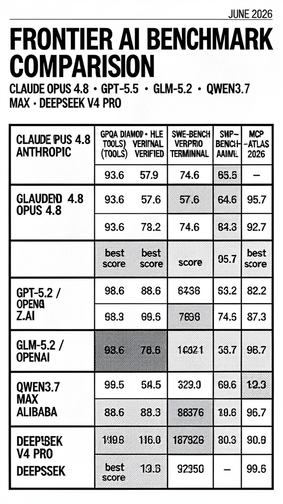

# Benchmark Infographics

AI model benchmark comparison infographics — freely shareable, proper sources.

## June 2026: Frontier AI Models

**Claude Opus 4.8 vs GPT-5.5 vs GLM-5.2 vs Qwen3.7 Max vs DeepSeek V4 Pro**

### Sources
- LLM Stats (llm-stats.com)
- Official model cards (HuggingFace, provider blogs)
- GLM-5.2 model card (zai-org/GLM-5.2)
- Qwen3.7 blog (qwen.ai)
- GPT-5.5 launch blog (openai.com)
- Claude Opus 4.8 launch materials (anthropic.com)

### Style
Nous Research brand identity — strict monochrome, Swiss grid, Courier Pro, halftone grain texture.
